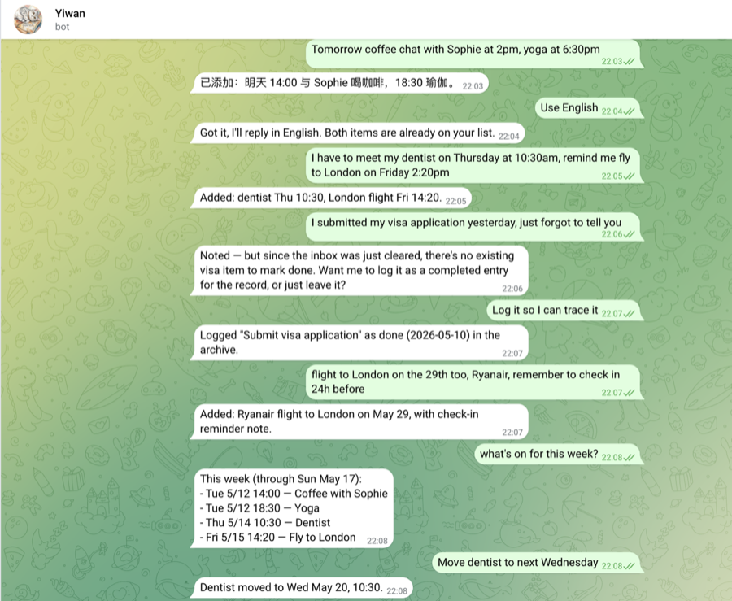
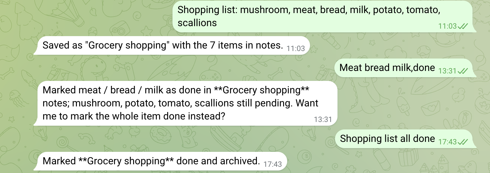

# yiwan_pa

> A personal AI assistant on Telegram. Captures, queries, and updates todos in natural language. Lives on a Raspberry Pi, runs 24/7, talks to you wherever you are.

[](LICENSE)

## What it does

Send the bot a Telegram message — anything from "Flight to London on the 29th, Ryanair, check in 24h before" to "what's on for this week?" to "move the dentist to next Wednesday" — and it does the right thing:

- **Capture** new todos with parsed dates, tags, and notes
- **Query** what's pending today, this week, or by topic
- **Update** existing items: change a due date, add notes, mark done, cancel
- **Plan multi-step work** as a *project* with ordered (`sequential`) or unordered (`parallel`) steps; bot tracks which step is current and which is blocked
- **Push** scheduled reminders: morning digest (today / upcoming / overdue / stale items with no due), evening check-in at 21:00 for today's still-pending, and per-item T-N alerts before time-sensitive items ("flight 提前 3h 2h 提醒")
- **Remember context** within a conversation — short follow-ups like "move that to next Wednesday" resolve to the previous turn

All state lives as plaintext markdown — no database, no vendor lock-in. Your todos are `cat`-able, `git diff`-able, hand-editable.

## Beyond todos

The same capture-and-act primitive now spans several domains of daily life, each with its own tools, storage, and (where useful) proactive reminders:

- **International transhipment parcels** — track online orders through ordering → shipping → warehouse consolidation in a Google Sheet, with per-SKU pricing, weight apportioning, and exchange-rate conversion. OCRs e-commerce and warehouse-arrival screenshots.
- **Fund 定投 (recurring investments)** — record monthly/weekly SIP debits and share confirmations from forwarded bank texts; query cumulative totals.
- **家庭花销 (household spending)** — line-item grocery ledger (price-trend + "what we buy most" analysis) with receipt-photo OCR, an inventory watchlist with auto-restock, and low-stock reminders. Records big annual costs too, so monthly totals have no unexplained gap.
- **Annual contract renewals** — remember energy/broadband/insurance expiry, remind to shop around before renewal, and compare this year's price to last year's.
- **Document fact-sheets + Q&A** — forward an insurance PDF; the model extracts a fact-sheet once at ingest, then answers later questions ("免赔额多少") from the distillate without re-reading the file.
- **CWI instructor logbook** — drafts Mountaineering Ireland DLOG entries after a climbing-instruction session, tracks progress toward the certificate's logbook targets, and reminds each evening to file them.
- **Web search** — looks up current public facts (a business's phone number, opening hours) when the answer isn't already on hand.

Each domain follows the same shape: a `tools/*.py` data layer, tool schemas the LLM can call, a section in the system prompt, and an optional daily reminder scheduler.

## Why I built it

Some weeks too many plates spin at once: two job-search side projects, a flight to catch, a vegetable patch to water, party hosting on Friday. The pattern is consistent — if I don't capture a thought the moment it surfaces, it's gone. The cost shows up later as a missed thing.

Phone todo apps weren't fast enough for capture. Each item demanded a manual lift: open the app, type the title, pick a list, set a date, configure a reminder. By the time I'd done that, two more thoughts had escaped.

I wanted a bot I could just *tell*. Send a sentence to Telegram — "Ryanair flight to London on the 29th — don't forget online check-in" — and have it figure out the structure, the date, the tags, the right place to put it. Once that primitive existed, the rest of the project followed: a bot that knows your patterns can do far more than capture todos. So why not start from the tiniest possible version, dogfood it daily, and let it grow with how I actually use it?

That's the thesis underneath this project: **the best personal assistant isn't the most capable one — it's the one most adapted to its single user.** Heavyweight general-purpose agents (OpenClaw, etc.) are impressive but generic. yiwan_pa is built for one human (me, for now) and aims to evolve toward how that human actually behaves, not the other way around.

## Demo



*Bilingual by default — Chinese and English in the same conversation. Say "use English" / "用中文" to switch the bot's reply language.*



*Natural-language task management — drop in a shopping list, tick items off as you buy them, and the bot tracks partial progress inside the item's notes before archiving the whole thing when it's done.*

## Architecture

```
                                 +--------------------+
   you (phone) <---Telegram----> | bot.py (long-poll) |
                                 +----------+---------+
                                            |
                              +-------------+--------------+
                              |                            |
                       +------v-------+            +-------v-------+
                       | LLMBackend   |            | storage/      |
                       | (abstract)   |            | markdown.py   |
                       +------+-------+            | history.py    |
                              |                    +-------+-------+
                  +-----------+-----------+                |
                  |                       |                |
        +---------v---------+   +---------v---------+      |
        | ClaudeCodeBackend |   | AnthropicBackend  |      |
        | (subprocess to    |   | (anthropic SDK +  |      |
        |  claude CLI, dev) |   |  self-written     |      |
        |                   |   |  agent loop)      |      |
        +-------------------+   +-------------------+      |
                                                           |
                                                  +--------v--------+
                                                  | data/           |
                                                  |   inbox.md      |
                                                  |   archive.md    |
                                                  |   history/*.jsonl|
                                                  +-----------------+
```

**Key parts:**

- **`bot.py`** — `python-telegram-bot` long-poll loop, command + message handlers, conversation-history glue, and registration of the scheduler jobs. Whitelists `TELEGRAM_USER_CHAT_ID` so the bot only responds to its owner.
- **`scheduler.py`** — per-minute scan loop for per-item T-N push alerts. Reads `data/inbox.md` each tick, partitions un-fired declared offsets into normal vs. late, sends + records to the item's `alerted` field on the next pass.
- **`*_scheduler.py` + `scheduler_base.py`** — the timed reminder jobs (contract / cwi / inventory / investment) plus `digest_scheduler.py` for the morning + evening digests, each exposing `register_jobs(app)`. `scheduler_base.py` holds the hourly-scan plumbing they share (env, the reminder-hour gate, JobQueue registration).
- **`llm/`** — `LLMBackend` interface plus two implementations (selected by `LLM_BACKEND` env var). The abstraction is real: each backend handles auth, agent looping, and tool execution differently, but the bot doesn't know.
- **`llm/anthropic_api.py`** — a self-written agent loop on top of the `anthropic` SDK. 40+ tools spanning todos, transhipment parcels, investments, household spending + inventory, contracts, documents, and the CWI logbook — plus the Anthropic `web_search` server tool; top-level prompt caching, adaptive thinking, typed exception handling.
- **`storage/markdown.py`** — typed parser/writer for `data/inbox.md` and `data/archive.md`. Each item is a level-2 markdown heading with `key: value` fields; format spec in `data/README.md`.
- **`storage/md_entities.py`** — shared parse/write skeleton for the other `## heading` + `- key: value` markdown stores (contracts, CWI logbook), so each domain keeps only its own dataclass and field mapping.
- **`storage/sheets.py`** — shared Google Sheets helpers (auth, safe cell read, the first-empty-row workaround, tolerant numeric parse, row writer) used by the parcels / investments / household-spending tools.
- **`storage/history.py`** — per-chat conversation history as JSONL with a sliding window (6 turns OR 30 minutes, whichever is shorter).
- **`prompts.py`** — system prompt for the assistant role, plus canned digest requests (morning + evening) for scheduled pushes. The assistant prompt is sliced into a core block + per-domain blocks so routing can ship only the sections a message needs.
- **`router.py`** — per-message domain routing: picks which domain(s) a message touches (by keyword / input type) and ships only those prompt blocks + tools, shrinking the per-call prefix from ~18k to ~4-7.5k tokens. Behind `ROUTING_ENABLED`, off by default (byte-identical when off).

## Notable engineering decisions

Real design records live in [`docs/decisions/`](docs/decisions/) (ADR format). Highlights:

- [**Pluggable LLM backend abstraction**](docs/decisions/0002-pluggable-llm-backend.md) — dependency-inverted so swapping shell-out for SDK requires no change to the bot. Lets the same code run on a Claude Code subscription (free, dev) or the Anthropic API (paid, prod).
- [**Self-written agent loop**](docs/decisions/0003-self-written-agent-loop.md) (`AnthropicBackend`) — instead of using a higher-level agent framework, the loop is hand-built so the harness behavior (tools, retry, prompt caching) is fully owned and inspectable.
- [**Markdown as the storage**](docs/decisions/) — readable, git-diffable, hand-editable. No DB schema. Storage helpers expose a typed interface anyway, so future migration is non-breaking.
- [**Conversation history as JSONL with sliding window**](docs/decisions/0001-conversation-history.md) — platform-independent (no PTB-specific persistence), survives container restarts, audit-friendly. Window combines turn count and elapsed time.
- [**Docker on Raspberry Pi over venv + systemd**](docs/decisions/) — operational consistency with the user's existing self-hosted services (Home Assistant). Auto-restart, isolation, easy redeploy.

## Tech stack

- **Python 3.12+**
- **[python-telegram-bot](https://python-telegram-bot.org/) 21+** — Telegram client + JobQueue scheduling
- **[anthropic](https://docs.anthropic.com/) Python SDK** — production LLM backend
- **Claude Opus 4.7** — primary model (Anthropic API). Sonnet 4.6 also tested.
- **Docker + Docker Compose** — production deployment on Raspberry Pi 5
- **[Tailscale](https://tailscale.com/)** — remote access to the Pi for ops
- **Standard library only** for storage, scheduling math, JSON handling — no DB, no ORM

## Running it yourself

### Prerequisites

- Python 3.12+ (for local dev) **or** Docker + Docker Compose (for production-style)
- A Telegram bot token from [@BotFather](https://t.me/BotFather)
- One of:
  - An [Anthropic API key](https://console.anthropic.com/settings/keys) (recommended for production)
  - A working Claude Code CLI authenticated to a Claude Pro/Max subscription (dev convenience)

### Quick start (Docker)

```bash
git clone https://github.com/Sophie-Zhen/yiwan_pa.git
cd yiwan_pa
cp .env.example .env
# Edit .env and fill in TELEGRAM_BOT_TOKEN, ANTHROPIC_API_KEY, USER_NAME, TZ, etc.
docker compose up -d --build
docker compose logs -f
```

In Telegram, talk to your bot. Try `/id` to find your chat ID, paste it back into `.env` as `TELEGRAM_USER_CHAT_ID` and `docker compose restart` so scheduled pushes know where to deliver.

### Local dev (no Docker)

```bash
python -m venv .venv && source .venv/bin/activate
pip install -r requirements.txt
cp .env.example .env  # set LLM_BACKEND=claude_code if you have the CLI
python bot.py
```

### Configuration

All config is environment variables in `.env`. See `.env.example` for the full list and descriptions. The most important are:

| Variable | Required | Purpose |
| --- | --- | --- |
| `TELEGRAM_BOT_TOKEN` | yes | Telegram bot identity |
| `LLM_BACKEND` | yes | `anthropic` (production) or `claude_code` (dev) |
| `ANTHROPIC_API_KEY` | if using `anthropic` | API auth |
| `USER_NAME` | yes | Used in the assistant's system prompt |
| `TZ` | yes | IANA timezone — drives container clock and digest scheduling |
| `DIGEST_TIME` | no, default `08:30` | Local-time HH:MM for the morning digest |
| `EVENING_DIGEST_TIME` | no, default `21:00` | Local-time HH:MM for the evening check-in |
| `TELEGRAM_USER_CHAT_ID` | needed for scheduled push **and for the whitelist** | Only this chat may message the bot; also where digests + T-N alerts are delivered |

## Project structure

```
yiwan_pa/
├── bot.py                       # entry point
├── scheduler.py                 # per-minute T-N alert scan loop
├── scheduler_base.py            # shared hourly-scan plumbing for reminders
├── *_scheduler.py               # per-domain reminders + digest_scheduler.py
├── router.py                    # per-message domain routing (behind ROUTING_ENABLED)
├── llm/                         # LLM backend abstraction
│   ├── base.py                  # LLMBackend interface
│   ├── claude_code.py           # subprocess to `claude` CLI
│   └── anthropic_api.py         # anthropic SDK + agent loop
├── storage/                     # plaintext + Google Sheets storage layer
│   ├── markdown.py              # inbox / archive parser
│   ├── md_entities.py           # shared markdown entity-store skeleton
│   ├── sheets.py                # shared Google Sheets helpers
│   └── history.py               # conversation history (JSONL)
├── prompts.py                   # system prompt + canned messages
├── data/                        # runtime state (gitignored except README)
│   ├── README.md                # markdown format spec
│   ├── inbox.md                 # active todos (gitignored)
│   ├── archive.md               # done / cancelled (gitignored)
│   └── history/                 # per-chat JSONL files (gitignored)
├── docs/decisions/              # ADRs — architectural decision records
├── Dockerfile
├── docker-compose.yml
├── requirements.txt
├── CHANGELOG.md
├── TODOS.md                     # forward-looking project todo
└── README.md                    # this file
```

## Status & roadmap

**v0.1.1** (last tagged, 2026-04-29) — multi-turn conversation, daily digest, Docker on Pi, two LLM backends. See [CHANGELOG](CHANGELOG.md) for the per-version detail.

**Since v0.1.1** (deployed, not yet tagged) — multi-step projects, per-item T-N push alerts, evening digest, stale-item surfacing in the morning digest, `find_item` + `append_to_notes` trust fixes, Telegram whitelist hardening.

**Next up** — driven by real-world usage; tracked in [TODOS.md](TODOS.md). Likely candidates: list grouping (购物清单 as one item with sub-checkable entries), `/todos` on-demand display, reversal handling, cross-device data sync, an event log for past events ("when did I last wash the car"), and a local-LLM backend (Ollama on a home PC) for privacy.

## License

[MIT](LICENSE).
